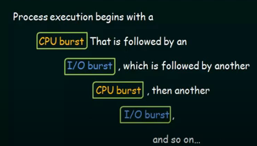
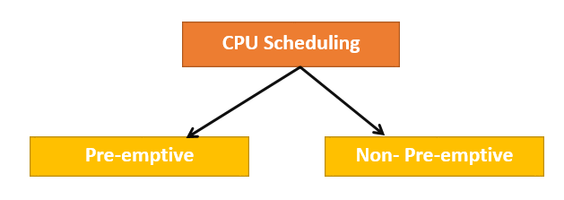

# Process Scheduling and its Scheduling Algorithms
### CPU Scheduling:
CPU Scheduling is the basis of Multiprogrammed Operating System.
By switching the CPU among processes, The Operating System can make the computer more productive.
### Basic Concept:
In a single-processor system, only one process can run at a time; any others must wait until the CPU is free and can be rescheduled.

* The objective of multiprogramming is to have some process running at all times, to maximize CPU utilization.
* A process is executed until it must wait, typically for the completion of some I/O request.

In a simple computer system, the CPU then sits idle. All this waiting time is wasted; no useful work is accomplished. With multiprogramming, we try to use this time productively. Several processes are kept in memory at one time.

When one process has to wait, the OS takes the CPU away from that process and gives the CPU to another process and this pattern continues.

### CPU and I/O Burst Cycles.
**The success of CPU scheduling depends on an observed property of processes:**

Process execution consists of a cycle of CPU execution and I/O wait.
Processes alternate between these two states.

CPU burst is when the process is being executed in the CPU.
I/O burst is when the CPU is waiting for I/O for further execution.

Eventually, the final CPU burst ends with a system request to terminate execution.

## Why do we need scheduling ?
As we know, a process needs CPU time and I/O time both for its execution. In a multi-programming system, one process can use CPU while another process is waiting for I/O whereas, on the other hand in a uni programming system, all the time get wasted in waiting for I/O whereas CPU is free during that time.

## **Preemptive and Non-Preemptive Scheduling:**  

### CPU Scheduler:
Whenever the CPU becomes idle, the OS must select one of the processes in the ready queue to be executed. The selection process is carried out by the short-term scheduler (or CPU scheduler). The scheduler selects a process from the processes in memory that are ready to execute and allocates the CPU to that process.

### Disatcher:
The disatcher is the module that gives control of the CPU to the process selected by the short-term scheduler.
The time it takes for the disatcher to stop one process and start another running is known as the disatcher latency.

CPU - Scheduling decisions may take place under the following four circumstances:
1. When a process switches from the running state to the waiting state.
2. When a process switches from the running state to the ready state. (for example, when an interrupt occurs).
3. When a process switches from the waiting state to the ready state. (for example, at completion of I/O).
4.  When a process terminates.

For situations 1 and 4, there is no choice in terms of scheduling. A new process (if one exists in the ready queue) must be selected for execution. However, there is a choice for situations 2 and 3.

When scheduling takes place only under circumstances 1 and 4, we say that the scheduling scheme is **Non-Preemptive or Cooperative**, otherwise, it is **Preemptive**.

## What algorithms are available for Scheduling?
CPU scheduling deals with the problem of deciding which of the processes in the ready queue is to be allocated the CPU. There are many different CPU-scheduling algorithms.

1. First-Come-First-Served (FCFS).
2. Shortest-Job-First (SJF).
3. Shortest Remaining Time First (SRTF).
4. Longest Remaining Time First (LRTF).
5. Priority Scheduling.
6. Round Robin(RR) Scheduling.
7. Multiple-Level Queue Scheduling.
8. Multiple-Level Feedback Queue Scheduling.

### The various metrics that are used for measuring the effectiveness of scheduling Algorithm:

Various CPU scheduling algorithms have different properties and the choice of a particular algorithm depends on the various factors. Many criteria have been suggested for comparing CPU scheduling algorithms. 

The criteria include the following: 

**CPU Utilisation:** The main objective of any CPU scheduling algorithm is to keep the CPU as busy as possible. Theoretically, CPU utilisation can range from 0 to 100 but in a real-time system, it varies from 40 to 90 percent depending on the load upon the system. 
 
**Throughput:** A measure of the work done by CPU is the number of processes being executed and completed per unit time. This is called throughput. The throughput may vary depending upon the length or duration of processes. 
 
**Turnaround Time:** For a particular process, an important criteria is how long it takes to execute that process. The time elapsed from the time of submission of a process to the time of completion is known as the turnaround time. Turn-around time is the sum of times spent waiting to get into memory, waiting in ready queue, executing in CPU, and waiting for I/O. 
 
**Waiting Time:** A scheduling algorithm does not affect the time required to complete the process once it starts execution. It only affects the waiting time of a process i.e. time spent by a process waiting in the ready queue. 
 
**Response Time:** In an interactive system, turn-around time is not the best criteria. A process may produce some output fairly early and continue computing new results while previous results are being output to the user. Thus another criteria is the time taken from submission of the process of request until the first response is produced. This measure is called response time. 