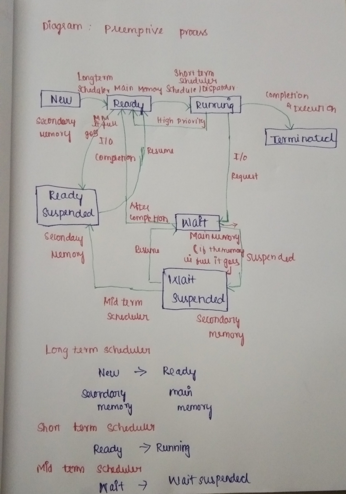

## What is CPU Scheduling:
 It is a process which allows one process to use the CPU while the execution of another process is on hold(in waiting state) due to unavailability of any resource like I/O etc, thereby making full use of CPU. **The aim of CPU scheduling is to make the system efficient, fast and fair.**
## Why Scheduling is Required:
In a **Single processor** system only one process can run at a time,any other must wait until the CPU is free and can be rescheduled. 

**Multiprocessor**:
The objective is  to have some process can  running at all times, to maximize the CPU utilization.A process is executed until it  must wait  typically for the completion of  some I/o  request.
## Concepts:
## CPU / I/O burst cycle
Process execution consists of a cycle of 
* CPU execution- when the process under CPU execution
* I/O wait- when the process under I/O wait.
* Process alternate between these two states
* **CPU burst**- when the process is being executed in CPU.
* **I/O burst**- when the CPU is waiting for I/O for further execution.
* Eventually the final CPU burst end with a system request to terminate execution.

CPU/I/O burst  cycle
* Almost all programs have some alternating cycle of CPU number crunching and waiting for I/O of some kind.
* In a simple system running a single process, the time spent waiting for I/O is wasted, and those CPU cycles are lost forever.
* A scheduling system allows one process to use the CPU while another is waiting for I/O, thereby making full use of otherwise lost CPU cycles.
* The challenge is to make the overall system as "efficient" and "fair" as possible, subject to varying and often dynamic conditions, and where "efficient" and "fair" are somewhat subjective terms, often subject to shifting priority policies.

##### CPU - Scheduling decisions may take place under the following four circumstances:
**Preemptive Scheduling:**
In Preemptive Scheduling, the tasks are mostly assigned with their priorities. Sometimes it is important to run a task with a higher priority before another lower priority task, even if the lower priority task is still running. The lower priority task holds for some time and resumes when the higher priority task finishes its execution.

**Non-Preemptive Scheduling:**
In this type of scheduling method, the CPU has been allocated to a specific process. The process that keeps the CPU busy will release the CPU either by switching context or terminating. It is the only method that can be used for various hardware platforms. That's because it doesn't need special hardware (for example, a timer) like preemptive scheduling.

## Scheduling criteria/Metrics

* **CPU utilization** – keep the CPU as busy as possible.
* **Throughput** – No of processes that complete their execution per time unit.
* **Turnaround time** – Amount of time to execute a particular process.
* **Waiting time** – Amount of time a process has been waiting in the ready queue.
 * **Response time** – Amount of time it takes from when a request was submitted until the first response is produced, not output (for a time-sharing environment).

## Scheduling algorithm optimization criteria
* **Max CPU utilization**
* **Max throughput**
* **Min turnaround time**
* **Min waiting time**
* **Min response time**

# Scheduling Algorithms
CPU scheduling deals with the problem of deciding which of the processes in the ready queue is to be allocated the CPU. There are many different CPU-scheduling algorithms.

* First-Come-First-Served (FCFS).
* Shortest-Job-First (SJF).
* Shortest Remaining Time First (SRTF).
* Longest Remaining Time First (LRTF).
* Priority Scheduling.
* Round Robin(RR) Scheduling.
* Multiple-Level Queue Scheduling.
* Multiple-Level Feedback Queue Scheduling.

