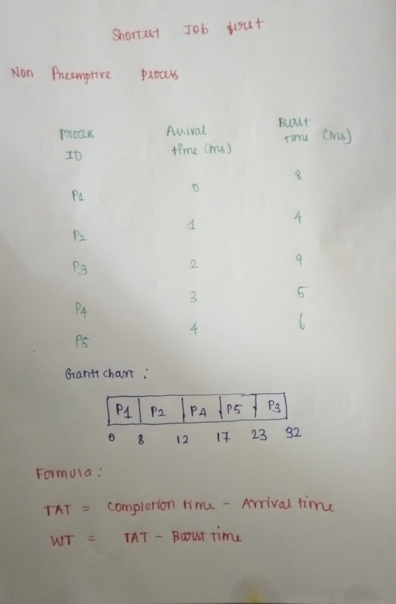
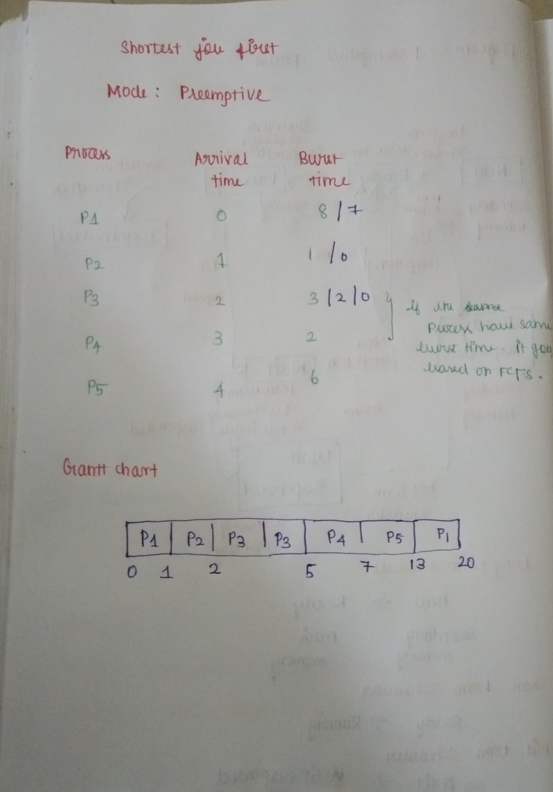

## Shortest Job First:
* Shortest Job First (SJF) is an algorithm in which the process having the smallest execution time is chosen for the next execution. 
* This scheduling method can be preemptive or non-preemptive. 
* It significantly reduces the average waiting time for other processes awaiting execution.
 * The full form of SJF is Shortest Job First.

 ## Function of SJF:
 * It is associated with each job as a unit of time to complete.
* It is used  for batch-type processing, where waiting for jobs to complete is not critical.
* It can improve process throughput by making sure that shorter jobs are executed first, hence possibly have a short turnaround time.

## Problem for NonPreemptive:
In non-preemptive scheduling, once the CPU cycle is allocated to process.
 The process holds it till it reaches a waiting state or terminated.
 
 Process | Arrival time  | Burst time | CT | TAT | WT
---------|---------------|------------|----|-----|---
P1 | 0 | 8 | 8 | 8 | 0
P2 | 1 | 4 | 12 | 11 | 7
P3 | 2 | 9 | 32 | 30 | 21
P4 | 3 | 5 | 17 | 14 | 9
P5 | 4 | 6 | 23 | 19 | 13

#### TurnAroundTime(TAT)=CT(Completion time)-AT(Arrivaltime)
#### WT(Waiting Time) =TAT-BT(Burst Time)
#### Avg TAT=(8+11+30+14+19)/5=82/5=16.4 ms
#### Avg WT=(0+7+21+9+13)/5=50/5=10 ms

## Problem for Preemptive:
* In Preemptive SJF Scheduling, jobs are put into the ready queue as they come.
 * A process with shortest burst time begins execution. 
* If a process with even a shorter burst time arrives, the current process is removed or preempted from execution, and the shorter job is allocated CPU cycle.

Process | Arrival time  | Burst time | CT | TAT | WT
---------|---------------|------------|----|-----|---
P1 | 0 | 8 | 20 | 20 | 12
P2 | 1 | 1| 2 | 1 |    0
P3 | 2 | 3 | 5 | 3 |   0
P4 | 3 | 2 | 7 | 4 |   2
P5 | 4 | 6 | 13 | 9 |  3

#### TurnAroundTime(TAT)=CT(Completion time)-AT(Arrivaltime)
#### WT(Waiting Time) =TAT-BT(Burst Time)
## Advantages of SJF
#### Avg TAT=(20+1+3+4+9)/5=37/5=7.4 ms
#### Avg WT=(12+0+0+2+3)/5=17/5=3.4 ms

* Maximum throughput
* Minimum average waiting and turnaround time
## Disadvantages of SJF

* May suffer with the problem of starvation
* It is not implementable because the exact Burst time for a process can't be known in advance.

## **Approaches in SJF**
 1. To try to approximate SJF scheduling.
1. we may not known the length of the next CPU burst but we may be able to predict its value.
2. we expect that the next CPU  burst will be similar in length to the previous ones.
3. Thus by computing an approximation of the length of the next CPU burst,we can pick the processes with the shortest predicted CPU burst